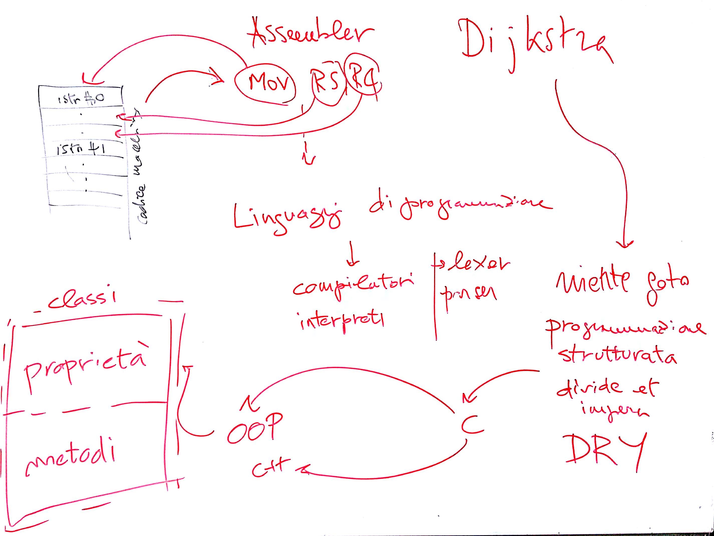
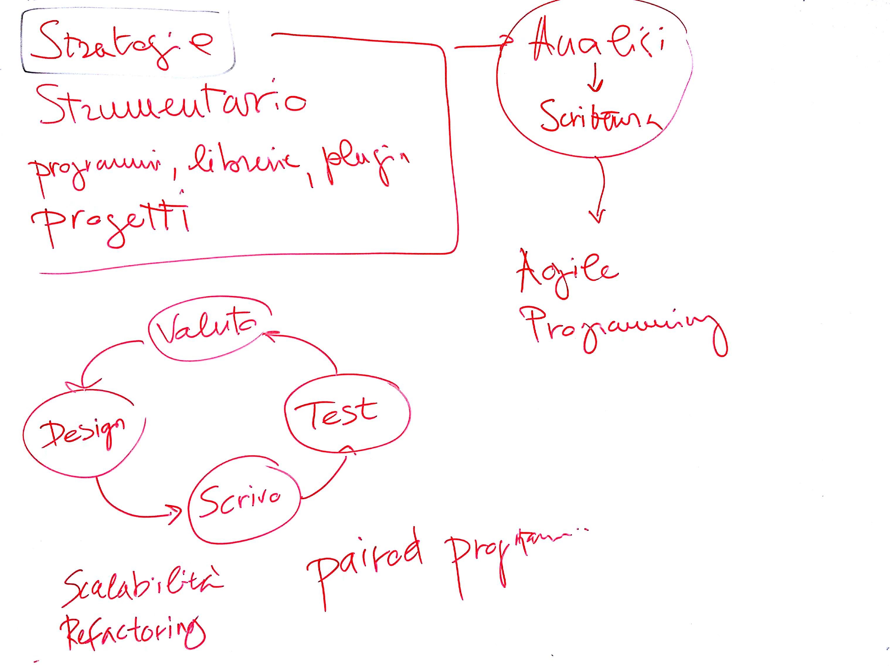
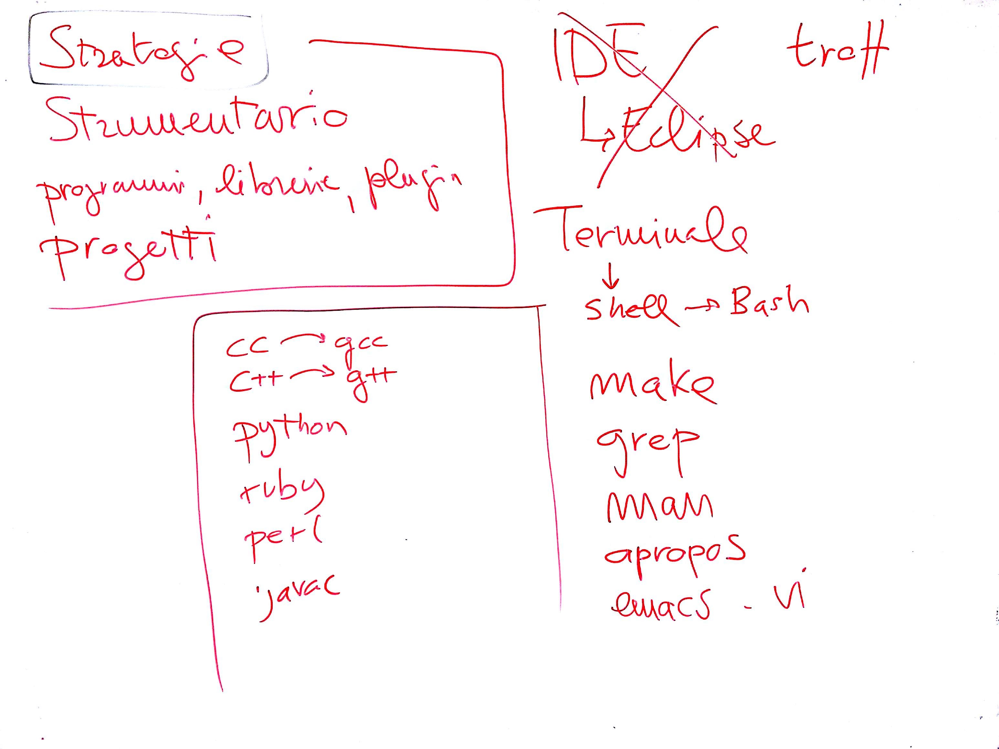
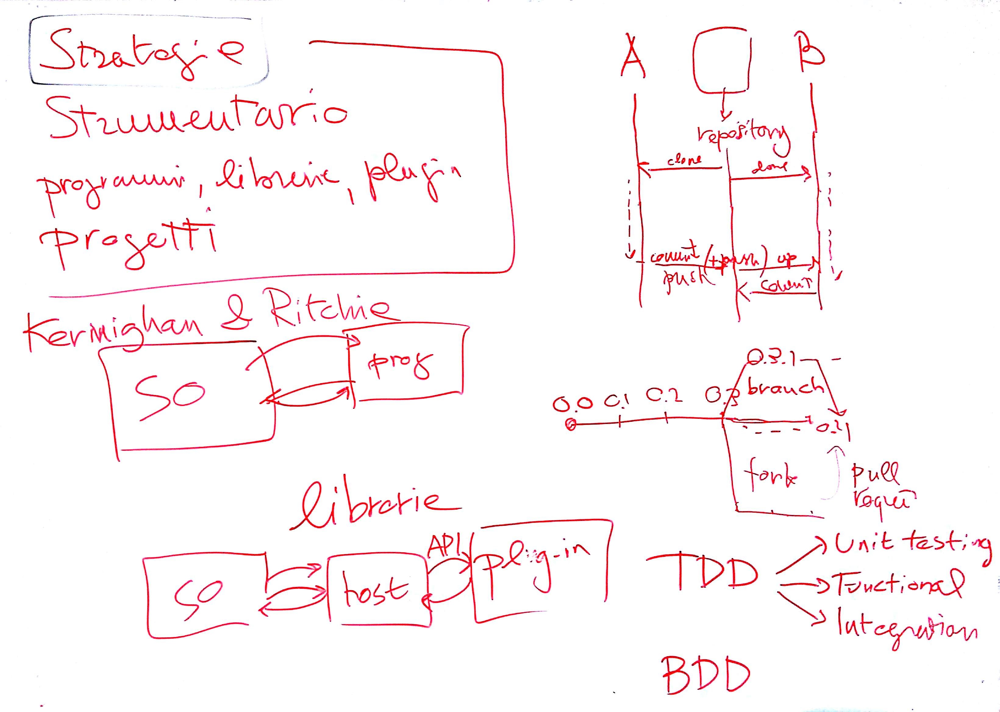

# Incontro del 23 giugno 2017

## Argomenti

* Introduzione al corso:
  * richieste e motivazioni
  * introduzione alla professione del programmatore
* Cenni storici sulla programmazione
  * Linguaggio macchina
  * *Assembly languages*
  * Programmazione Strutturata (cf. Dijkstra)
  * Tipi naturali e tipi artificiali
  * Programmazione orientata agli oggetti
* Linguaggi di programmazione
  * Linguaggi compilati (`c`, `c++`)
  * Linguaggi interpretati (`python`, `ruby`, `perl`, ...)
  * Linguaggi ibridi (`java`, `jython`, `jruby`, `scala`, ...)
* Paradigmi della programmazione orientata agli oggetti:
  * Oggetti: *classi* e *istanze*
  * *Proprietà* e *metodi*

* Strategie di programmazione:
  * Cenni storici: analisi precedente alla scrittura
  * Paradigma attuale: *agile programming*
    * ciclo *design => scrittura => test => valutazione*
    * *paired programming*
  * Elementi di qualità: *scalabilità*, *refactoring* (riscrittura)

* Strumentario necessario:
  * emulatore di terminale (`bash shell`)
  * `make`
  * `grep`
  * `man`
  * `apropos`
  * editor di testo a piacere (inline nell'emulatore di terminale - `emacs`,
    `vi` - oppure a finestre - `textmate`, `atom`, `gedit`, ...)
  * `git`
* Compilatori e interpreti:
  * `gcc`/`g++`
  * `javac`
  * `python`
  * `ruby`
  * `perl`

* Differenze tra programmi, librerie (statiche e dinamiche) e *plug-in*
* Paradigmi ausiliari all'*agile programming*:
  * *TDD* (`test-driven development`)
    * *Unit testing*
    * *Functional testing*
    * *Integration testing*
  * *BDD* (`behaviour-driven development`)
* funzionamento dei sistemi di *source code management* (*SCM*) e in
  particolare di `git`
* introduzione ai progetti (individuali e di gruppo)

## Compiti per casa

### The C Programming Language written by Brian Kernighan and Dennis Ritchie

Leggere i primi sei capitoli e scrivere tutti i programmi seguendo le
istruzioni qui sotto.

### Istruzioni per la realizzazione dei programmi

1. Ciascuno studente cloni [questo repository](https://github.com/SMERM/SPERM)
   sulla propria macchina
1. Ciascuno studente crei una propria cartella all'interno della cartella
   `_WORKSPACE`. Il nome della cartella dovrà essere generato seguendo
   [queste istruzioni](../../_WORKSPACE/README.md)
1. All'interno della cartella, ciascun programma deve essere inserito in una
   cartella (ad es.: il programma `hello.c` scritto da Ezechiele Lupo dovrà
   essere collocato nella seguente alberatura: `_WORKSPACE/EZCL ZAPM/hello/hello.c`)
1. Ciascuno studente sarà poi responsabile dei propri `commit`, `pull`, ecc.
