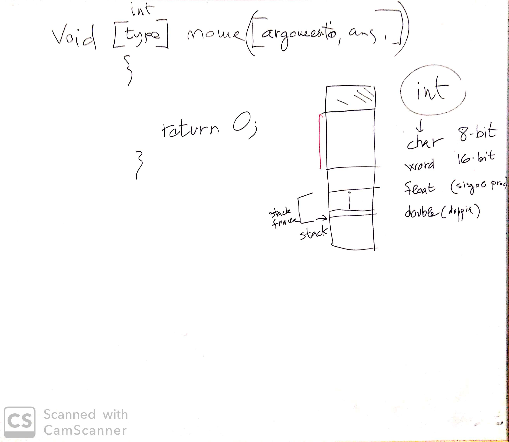

# Incontro del 13 gennaio 2020

## Argomenti

* Backtracking sulla sintassi `C` prima di re-analizzare il codice `osc` già prodotto:
  * `hello.c`
  * ristrutturazione in funzioni
  * definizione e utilizzo delle funzioni
  * la nozione di *stack* e *stack frame* (funzionamento interno delle funzioni)

## Lavagna

## Compiti per casa

* scrivere programmi variazioni sul tema `ciao mondo`
