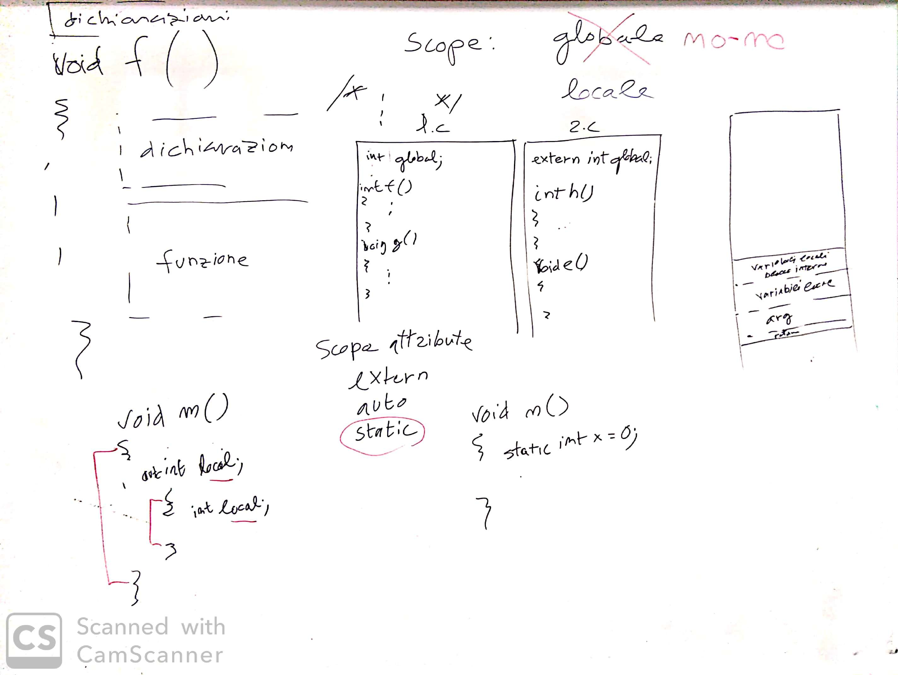

# Incontro del 20 gennaio 2020

## Argomenti

* Backtracking sulla sintassi `C` prima di re-analizzare il codice `osc` già prodotto:
  * dichiarazioni delle variabili
    * *variable scope*
    * *visibility*
    * attributi: `auto`, `static`

## Lavagna



## Programmi realizzati in classe

## [Obliterazione di variabili locali (*shadowing*)](./shadow.c)

```C
#include <stdio.h>


int main()
{
	int local,visible;
	local=33;
	visible=local+1;
	printf("%d %d\n",local,visible);
	{
		int local;
		local=42;
		printf("%d %d\n",local,visible);
	}
	printf("%d %d\n",local,visible);
}
```

```bash
$ cc -o shadow shadow.c
$ ./shadow
=> 33 34
=> 42 34
=> 33 34
```

## [Utilizzo dell'attributo `static` su variabili all'interno di funzioni](./static.c) 

(con elucubrazione a latere su pre-incremento e post-incremento delle variabili)

```C
#include <stdio.h>

void n()
{
	static int s=0;
	printf("%d\n",s++); /* post-incremento */
	printf("%d\n",++s); /* pre-incremento  */
	
}
void main()
{
	n();
	n();
	n();
}
```

```bash
$ cc -o static static.c
$ ./static
=> 0
=> 2
=> 2
=> 4
=> 4
=> 6
```

## [Utilizzo dell'attributo `static` su variabili all'interno di files](./static_main.c) 

Questo esempio ha bisogno di uno sviluppo su più files ([static2_1.c](./static2_1.c), [static2_2.c](./static2_2.c) e [static_main.c](./static_main.c))

[static2_1.c](./static2_1.c)
```C
#include <stdio.h>

static int ss=0;
void f11()
{
	printf("f11: %d\n",ss++);
}
void f12()
{
	printf("f12: %d\n",ss++);
}
```

[static2_2.c](./static2_2.c)
```C
#include <stdio.h>

static int ss=0;
void f21()
{
	printf("f21: %d\n",ss++);
}
void f22()
{
	printf("f22: %d\n",ss++);
}
```

[static_main.c](./static_main.c)
```C
void f11();
void f12();
void f21();
void f22();
void main()
{
	f11();
	f12();
	f21();
	f22();
}
```

```bash
$ cc -o static2 static_main.c static2_1.c static2_2.c
$ ./static2
=> f11: 0
=> f12: 1
=> f21: 0
=> f22: 1
```

## Compiti per casa

* scrivere, compilare e far girare 4 piccoli programmi per verificare l'effettiva consistenza
  degli argomenti visti in classe:
  * *variable scope* and *visibility*
  * attributi:
    * `static`:
      * utilizzo nelle variabili
      * utilizzo nelle funzioni
