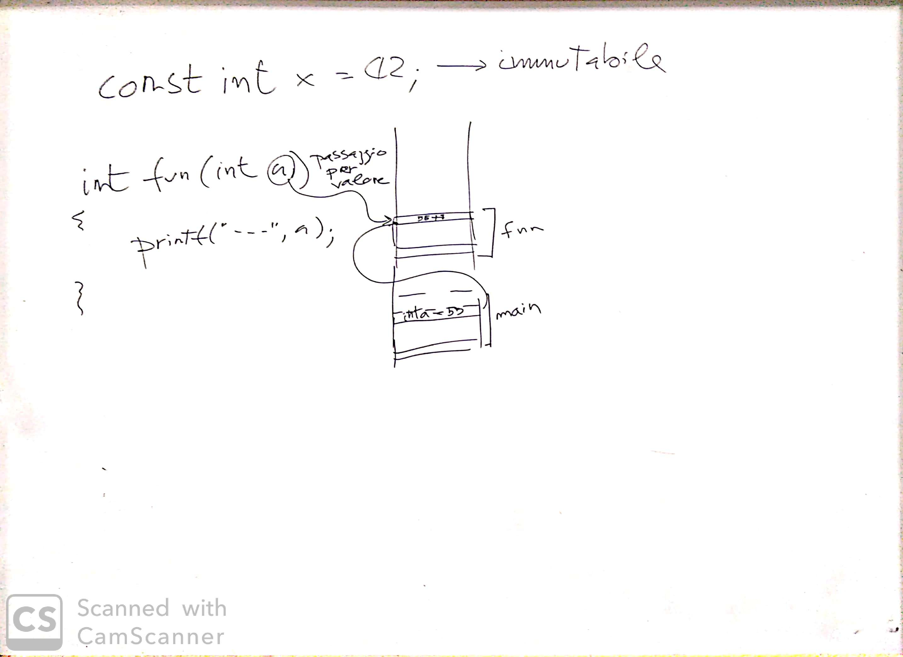

# Incontro del 3 febbraio 2020

## Argomenti

* Backtracking sulla sintassi `C` prima di re-analizzare il codice `osc` già prodotto:
  * dichiarazioni delle variabili
    * attributi: `const`
    * argomenti
      * passaggio per valore
      * `const`

## Lavagna

## Compiti per casa

* scrivere, compilare e far girare piccoli programmi per verificare l'effettiva consistenza
  degli argomenti visti in classe:
  * attributi:
    * `const`:
      * utilizzo nelle variabili
      * utilizzo negli argomenti
      * utilizzo nelle funzioni
  * argomenti:
    * passaggio per valore
