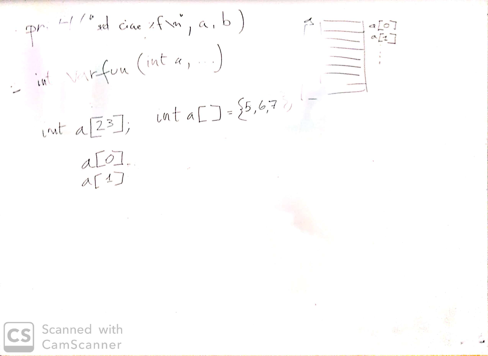

# Incontro del 24 febbraio 2020

## Argomenti

* Backtracking sulla sintassi `C` prima di re-analizzare il codice `osc` già prodotto:
  * argomenti
    * introduzione agli argomenti variabili (senza spiegazione)
  * *arrays*

## Lavagna



## Codice `C`

### [Argomenti variabili](./varfun.c)

```C
#include <stdio.h>
int varfun (int a , ...)
{
  return a;
}

int main()
{
  varfun (23,46);
  printf("%d\n", varfun (23,47,16));

}
```

```sh
$ cc -o varfun varfun.c
$ ./varfun
23
```

### [Dichiarazione e utilizzazione degli array](./arrayzero.c)

```C
#include <stdio.h>
int main()
{
  int a[3];
  a[0] = 5;
  a[1] = 6;
  a[2] = 7;
  printf("a[0] = %d\na[1] = %d\na[2] = %d\n", a[0] , a[1] , a[2]);
  return 0;
}
```

```sh
$ cc -o arrayzero arrayzero.c
$ ./arrayzero
a[0] = 5
a[1] = 6
a[2] = 7
```

### [Dichiarazione inizializzata](./arrayuno.c)

```C
#include <stdio.h>
int main()
{
  int a[]= {5 , 6 ,7 };  /* non specifico la dimensione tra parentesi tonde*/
  printf("a[0] = %d\na[1] = %d\na[2] = %d\n", a[0] , a[1] , a[2]);
  return 0;
}
```

```sh
$ cc -o arrayuno arrayuno.c
$ ./arrayuno
a[0] = 5
a[1] = 6
a[2] = 7
```

### [Dichiarazione con inizializzazione incompleta (1)](./arraydue.c)

```C
#include <stdio.h>
int main()
{
  int a[3]= {5 , 6 };
  printf("a[0] = %d\na[1] = %d\na[2] = %d\n", a[0] , a[1] , a[2]);
  return 0;
}
```

```sh
$ cc -o arraydue arraydue.c
$ ./arraydue
a[0] = 5
a[1] = 6
a[2] = 0
```

Questo risultato dipende dall'implementazione del compilatore. Non è scontato
che `a[2] == 0`.

### [Dichiarazione con inizializzazione incompleta (2)](./arraytre.c)

```C
#include <stdio.h>
int main()
{
  int a[3]= {2};   /*il risultato degli altri elementi è indefinito*/
  printf("a[0] = %d\na[1] = %d\na[2] = %d\n", a[0] , a[1] , a[2]);
  return 0;
}
```

```sh
$ cc -o arraytre arraytre.c
$ ./arraytre
a[0] = 2
a[1] = 0
a[2] = 0
```
Questo risultato dipende dall'implementazione del compilatore. Non è scontato
che `a[1] == 0` e `a[2] == 0`.

## Compiti per casa

* scrivere, compilare e far girare piccoli programmi per verificare l'effettiva consistenza
  degli argomenti visti in classe:
  * *arrays*: dichiarazione, dichiarazione inizializzata, utilizzo (accesso)
