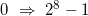
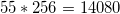
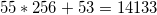

# Incontro del 13 marzo 2020 (effettuato in remoto)

## Test del sistema

* audio
* video
* condivisione schermi

## Argomenti

* Backtracking sulla sintassi `C` prima di re-analizzare il codice `osc` già prodotto:
  * *arrays*
    * le *stringhe* come *array* di numeri a 8 bit (`char`)

## Codice

### [stringhe: dichiarazione e utilizzo](./string1.c)

```C
#include <stdio.h> 

int main()
{
	char s[10]={'\0'};
	s[0]= 71;
	s[1]= 65;
	s[2]= 89;
	printf ("%s\n",s);
	
	return 0;
}
```

```sh
$ cc -o string1 string1.c
$ ./string1
GAY
```

### [stringhe: dichiarazione inizializzata con overflow dei caratteri e warning](./string2.c)

```C
#include <stdio.h> 

int main()
{
	char s[5]={'75','75','75','75','75'};
	s[0]= 71;
	s[1]= 65;
	s[2]= 89;
	s[4]= '\0'; 
	printf ("%s\n",s);
	
	return 0;
}
```

```sh
nicb-p302u:.../20200313$ cc -o string2 string2.c
string2.c: In function ‘main’:
string2.c:5:13: warning: multi-character character constant [-Wmultichar]
  char s[5]={'75','75','75','75','75'};
             ^~~~
string2.c:5:13: warning: overflow in conversion from ‘int’ to ‘char’ changes value from ‘14133’ to ‘53’ [-Woverflow]
string2.c:5:18: warning: multi-character character constant [-Wmultichar]
  char s[5]={'75','75','75','75','75'};
                  ^~~~
string2.c:5:18: warning: overflow in conversion from ‘int’ to ‘char’ changes value from ‘14133’ to ‘53’ [-Woverflow]
string2.c:5:23: warning: multi-character character constant [-Wmultichar]
  char s[5]={'75','75','75','75','75'};
                       ^~~~
string2.c:5:23: warning: overflow in conversion from ‘int’ to ‘char’ changes value from ‘14133’ to ‘53’ [-Woverflow]
string2.c:5:28: warning: multi-character character constant [-Wmultichar]
  char s[5]={'75','75','75','75','75'};
                            ^~~~
string2.c:5:28: warning: overflow in conversion from ‘int’ to ‘char’ changes value from ‘14133’ to ‘53’ [-Woverflow]
string2.c:5:33: warning: multi-character character constant [-Wmultichar]
  char s[5]={'75','75','75','75','75'};
                                 ^~~~
string2.c:5:33: warning: overflow in conversion from ‘int’ to ‘char’ changes value from ‘14133’ to ‘53’ [-Woverflow]
nicb-p302u:.../20200313$ ./string2
GAY5
```

Gli `warning` sono legati al fatto che abbiamo cercato di inizializzare uno o
più `char` con *due* caratteri (in questo caso: un carattere `7` e un
carattere `5`), ossia due numeri a 8-bit anziché uno solo (con gli apici
singoli si può definire soltanto un numero a 8 bit). Il `warning` in questione
avverte il programmatore che il numero `14133` non è un numero a 8 bit (numeri
nel range , ossia `0-255`. In questo caso, `14133` risulta dalla
combinazione del carattere ASCII `7` moltiplicato per `256` (perché facente
parte degli 8 bit a più a *sinistra*), ossia  e sommato al
carattere ASCII `5` (`53`), ossia .
Questi caratteri a 16-bit vengono quindi riconvertiti a caratteri a 8-bit
raccogliendo solo i primi 8-bit a destra, ossia `53`, che equivalgono al
carattere ASCII `5`.

### [le stringhe sono `0`-terminate](./string3.c)

```C
#include <stdio.h> 

int main()
{
	char s[6]={71,0,71,65,89,0};
	 
	printf ("%s %s\n",s,&s[2]);
	
	return 0;
}
```

```sh
$ cc -o string3 string3.c 
$ ./string3
G GAY
```

In questo esempio dimostriamo che le stringhe sono `0-terminate`, ossia si
concludono con l'inserzione di un *numero* `0`. Nel caso specifico, ponendo un
numero `0` al secondo posto dell'array avremo due stringhe contenute nello
stesso array di `char`.

### [Inizializzazione semplice delle stringhe](./string4.c)

```C
#include <stdio.h> 

int main()
{
	char s[]="Gabriele is smth";
	 
	printf ("%s %s\n",s,&s[2]);
	
	return 0;
}
```

```sh
$ cc -o string4 string4.c
$ ./string4
Gabriele is smth briele is smth
```

## Compiti per casa

* scrivere, compilare e far girare piccoli programmi per verificare l'effettiva consistenza
  degli argomenti visti in classe:
  * stringhe:
    * dichiarazione, dichiarazione inizializzata, utilizzo
    * verifica dello `\0` finale
    * replica della funzione di libreria `strlen`
    * replica della funzione di libreria `strtok`
    * realizzazione della funzione `int conta_vocali(const char *);` (che ritorna il numero di vocali presenti in una stringa)
