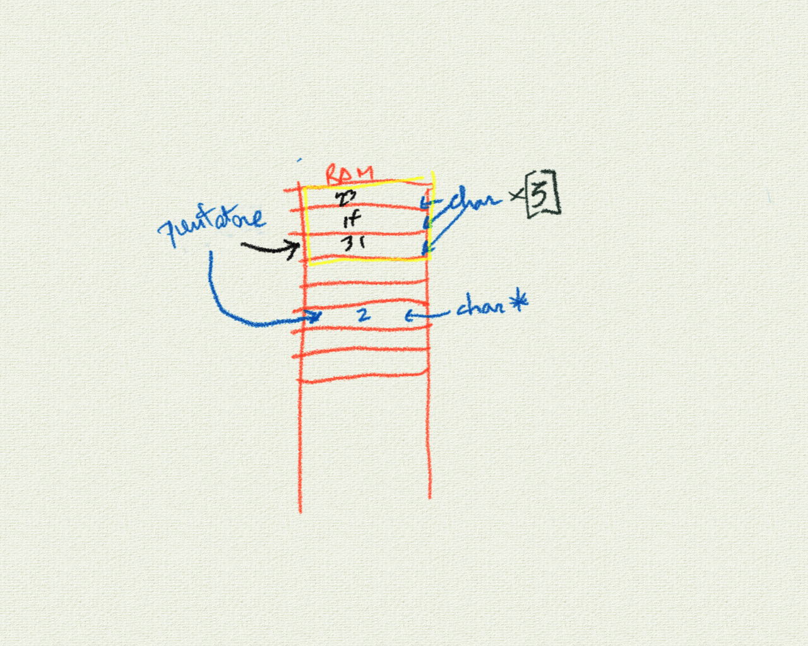

# Incontro del 20 marzo 2020 (effettuato in remoto)

## Argomenti

* Backtracking sulla sintassi `C` prima di re-analizzare il codice `osc` già prodotto:
  * *strutture*
  * introduzione ai puntatori

## Codice `C` scritto in classe

### Le strutture dati

#### [Strutture dati: definizione e dichiarazione](./struct0.c)

```C
/*STRUTTURE DATI*/
/*alcuni tipi di dati non possono essere rappresentati dai nostri TIPI (char, INT , float ecc)
cosi utilizziamo nuovi tipi composti dall'addizione dei "tipi tipici": le strutture dati.
cosa sono se non altro caratteristiche o parametri di un determinato elemento preso in considerazione?*/
/*definire una struttura; come è fatta la struttura*/
#include <stdio.h>
struct persona
{
  char nome    [20]  ;
  char cognome [20] ;
  unsigned long int numero ;
};

/*utilizzare la struttura dopo averla definita*/
int main()
{
  struct persona giulio = {"Giulio Romano", "De Mattia", 3423232342};
  printf("nome : %s,\ncognome : %s,\nnumero : %d\n", giulio.nome , giulio.cognome , giulio.numero);
}
```

```sh
nicb-p302u:.../20200320$ cc -o struct0 struct0.c
nicb-p302u:.../20200320$ ./struct0
nome : Giulio Romano,
cognome : De Mattia,
numero : -871734954
```

Il codice presenta un risultato sbagliato (il numero non corrisponde al numero
immesso, perché il *convertitore* `%d` nel printf converte il numero di
telefono (un intero lungo non segnato, 64-bit) in un intero segnato (16-bit), interpretando il
bit più alto come un bit di segno. Ponendo il convertitore invece a `%lu` si
ottiene la conversione corretta.

```C
/*STRUTTURE DATI*/
/*alcuni tipi di dati non possono essere rappresentati dai nostri TIPI (char, INT , float ecc)
cosi utilizziamo nuovi tipi composti dall'addizione dei "tipi tipici": le strutture dati.
cosa sono se non altro caratteristiche o parametri di un determinato elemento preso in considerazione?*/
/*definire una struttura; come è fatta la struttura*/
#include <stdio.h>
struct persona
{
  char nome    [20]  ;
  char cognome [20] ;
  unsigned long int numero ;
};

/*utilizzare la struttura dopo averla definita*/
int main()
{
  struct persona giulio = {"Giulio Romano", "De Mattia", 3423232342};
  printf("nome : %s,\ncognome : %s,\nnumero : %lu\n", giulio.nome , giulio.cognome , giulio.numero);
}
```
```sh
$ cc -o struct0 struct0.c
$ ./struct0
nome : Giulio Romano,
cognome : De Mattia,
numero : 3423232342
```

#### [strutture 1: il campo numerico diviene una stringa](./struct1.c)

```C
/*utilizzare un array di char e la struttura diviene "un array di caratteri"*/
#include <stdio.h>
struct persona
{
  char nome    [20] ;
  char cognome [20] ;
  char numero  [128];
};

/*utilizzare la struttura dopo averla definita*/
int main()
{
  struct persona giulio = {"Giulio Romano", "De Mattia", "0039-342-3232-342"};
  printf("nome : %s,\ncognome : %s,\nnumero : %s\n", giulio.nome , giulio.cognome , giulio.numero);
}
```

#### [struttura: conversione letterale del numero di telefono](./struct1.c)

```C
/*utilizzare un array di char e la struttura diviene "un array di stringhe"*/
#include <stdio.h>
struct persona
{
  char nome    [20] ;
  char cognome [20] ;
  char numero  [128];
};

/*utilizzare la struttura dopo averla definita*/
int main()
{
  struct persona giulio = {"Giulio Romano", "De Mattia", "0039-342-3232-342"};
  printf("nome : %s,\ncognome : %s,\nnumero : %s\n", giulio.nome , giulio.cognome , giulio.numero);
}
```

```sh
$ cc -o struct1 struct1.c
$ ./struct1
nome : Giulio Romano,
cognome : De Mattia,
numero : 0039-342-3232-342
```

#### [strutture 2: realizazione di un'agendina telefonica](./struct2.c)

```C
/*AGGENDINA TELEFONICA*/
/*utilizzare un array di char e la struttura diviene "un array di stringhe"*/
#include <string.h>
#include <stdio.h>
struct persona
{
  char nome    [20] ;
  char cognome [20] ;
  char numero  [128];
  char soprannome[34];
};
/*utilizzare la struttura dopo averla definita*/
int main()
{
  struct persona aggendina [2];

  strcpy(aggendina[0].nome, "Giulio");
  strcpy(aggendina[0].cognome, "De Mattia");
  strcpy(aggendina[0].numero, "342-3232-342");
  strcpy(aggendina[0].soprannome, "er patata");
  printf("nome: %s,\ncognome: %s,\nnumero: %s,\nsoprannome: %s,\n", aggendina[0].nome , aggendina[0].cognome , aggendina[0].numero , aggendina[0].soprannome);
}
```

```sh
nicb-p302u:.../20200320$ cc -o struct2 struct2.c
nicb-p302u:.../20200320$ ./struct2
nome: Giulio,
cognome: De Mattia,
numero: 342-3232-342,
soprannome: er patata,
```

#### [strutture 3: scorrimento automatico di un'agendina telefonica (elenco)](./struct3.c)

```C
#include <string.h>
#include <stdio.h>
struct persona
{
  char nome    [20] ;
  char cognome [20] ;
  char numero  [128];
  char soprannome[34];
};
/*utilizzare la struttura dopo averla definita*/
int main()
{
  const int num = 2;
  struct persona aggendina [num];
  int i;

  strcpy(aggendina[0].nome, "Giulio");
  strcpy(aggendina[0].cognome, "De Mattia");
  strcpy(aggendina[0].numero, "342-3232-342");
  strcpy(aggendina[0].soprannome, "er patata");
  strcpy(aggendina[1].nome, "TRUMP");
  strcpy(aggendina[1].cognome, "DONUTS");
  strcpy(aggendina[1].numero, "342-3232-666");
  strcpy(aggendina[1].soprannome, "er CHICCO FRESCO");

  for (i = 0; i < num; ++i)
  {
    printf("nome:\t%s,\ncognome:\t%s,\nnumero:\t%s,\nsoprannome:\t%s,\n\n", aggendina[i].nome , aggendina[i].cognome , aggendina[i].numero , aggendina[i].soprannome);
  }

}
```

```sh
$ cc -o struct3 struct3.c
$ ./struct3
nome:	Giulio,
cognome:	De Mattia,
numero:	342-3232-342,
soprannome:	er patata,

nome:	TRUMP,
cognome:	DONUTS,
numero:	342-3232-666,
soprannome:	er CHICCO FRESCO,
```

### I puntatori

I puntatori sono numeri che indicano indirizzi di memoria e non *contenuti*.



#### [introduzione ai puntatori](./ptr0.c)

```C
/*I PUNTATORI*/
#include <stdio.h>
#include <string.h>
int main()
 {
   const int dim = 50 ;
   int i = 0;
   char nome[dim];
   /*definiamo un puntatore a char; il tipo del puntatore nell dichiarazione è il tipo scelto piu' la star (*)  */
   char *p;
   p = &nome[0];
   p = nome; /*il nome della variabile nome è in realtà l'indirizzo della prima locazione dell'array*/
   strcpy(nome , "trovi un gatto nero morto crocifisso sul muro");
   for(i = 0; i < dim ; ++i)
   { /*%p è del puntatore*/
     printf("indirizzo: %p, contenuto: %1c\t%4d,  i: %2d\n", p , *p , *p, i);
     ++p;
   }
 }
```

```sh
indirizzo: 0x7ffeb31e5790, contenuto: t	 116,  i:  0
indirizzo: 0x7ffeb31e5791, contenuto: r	 114,  i:  1
indirizzo: 0x7ffeb31e5792, contenuto: o	 111,  i:  2
indirizzo: 0x7ffeb31e5793, contenuto: v	 118,  i:  3
indirizzo: 0x7ffeb31e5794, contenuto: i	 105,  i:  4
indirizzo: 0x7ffeb31e5795, contenuto:  	  32,  i:  5
indirizzo: 0x7ffeb31e5796, contenuto: u	 117,  i:  6
indirizzo: 0x7ffeb31e5797, contenuto: n	 110,  i:  7
indirizzo: 0x7ffeb31e5798, contenuto:  	  32,  i:  8
indirizzo: 0x7ffeb31e5799, contenuto: g	 103,  i:  9
indirizzo: 0x7ffeb31e579a, contenuto: a	  97,  i: 10
indirizzo: 0x7ffeb31e579b, contenuto: t	 116,  i: 11
indirizzo: 0x7ffeb31e579c, contenuto: t	 116,  i: 12
indirizzo: 0x7ffeb31e579d, contenuto: o	 111,  i: 13
indirizzo: 0x7ffeb31e579e, contenuto:  	  32,  i: 14
indirizzo: 0x7ffeb31e579f, contenuto: n	 110,  i: 15
indirizzo: 0x7ffeb31e57a0, contenuto: e	 101,  i: 16
indirizzo: 0x7ffeb31e57a1, contenuto: r	 114,  i: 17
indirizzo: 0x7ffeb31e57a2, contenuto: o	 111,  i: 18
indirizzo: 0x7ffeb31e57a3, contenuto:  	  32,  i: 19
indirizzo: 0x7ffeb31e57a4, contenuto: m	 109,  i: 20
indirizzo: 0x7ffeb31e57a5, contenuto: o	 111,  i: 21
indirizzo: 0x7ffeb31e57a6, contenuto: r	 114,  i: 22
indirizzo: 0x7ffeb31e57a7, contenuto: t	 116,  i: 23
indirizzo: 0x7ffeb31e57a8, contenuto: o	 111,  i: 24
indirizzo: 0x7ffeb31e57a9, contenuto:  	  32,  i: 25
indirizzo: 0x7ffeb31e57aa, contenuto: c	  99,  i: 26
indirizzo: 0x7ffeb31e57ab, contenuto: r	 114,  i: 27
indirizzo: 0x7ffeb31e57ac, contenuto: o	 111,  i: 28
indirizzo: 0x7ffeb31e57ad, contenuto: c	  99,  i: 29
indirizzo: 0x7ffeb31e57ae, contenuto: i	 105,  i: 30
indirizzo: 0x7ffeb31e57af, contenuto: f	 102,  i: 31
indirizzo: 0x7ffeb31e57b0, contenuto: i	 105,  i: 32
indirizzo: 0x7ffeb31e57b1, contenuto: s	 115,  i: 33
indirizzo: 0x7ffeb31e57b2, contenuto: s	 115,  i: 34
indirizzo: 0x7ffeb31e57b3, contenuto: o	 111,  i: 35
indirizzo: 0x7ffeb31e57b4, contenuto:  	  32,  i: 36
indirizzo: 0x7ffeb31e57b5, contenuto: s	 115,  i: 37
indirizzo: 0x7ffeb31e57b6, contenuto: u	 117,  i: 38
indirizzo: 0x7ffeb31e57b7, contenuto: l	 108,  i: 39
indirizzo: 0x7ffeb31e57b8, contenuto:  	  32,  i: 40
indirizzo: 0x7ffeb31e57b9, contenuto: m	 109,  i: 41
indirizzo: 0x7ffeb31e57ba, contenuto: u	 117,  i: 42
indirizzo: 0x7ffeb31e57bb, contenuto: r	 114,  i: 43
indirizzo: 0x7ffeb31e57bc, contenuto: o	 111,  i: 44
indirizzo: 0x7ffeb31e57bd, contenuto: 	   0,  i: 45
indirizzo: 0x7ffeb31e57be, contenuto: 	   0,  i: 46
indirizzo: 0x7ffeb31e57bf, contenuto: 	   0,  i: 47
indirizzo: 0x7ffeb31e57c0, contenuto: 	   0,  i: 48
indirizzo: 0x7ffeb31e57c1, contenuto: 	   0,  i: 49
```

## Compiti per casa

* scrivere, compilare e far girare piccoli programmi per verificare l'effettiva consistenza
  degli argomenti visti in classe:
  * *strutture*: definizione, dichiarazione, dichiarazione inizializzata, utilizzo (accesso)
  * puntatori:
    * dichiarazione, utilizzo, de-referenziazione
    * capire cosa succede in `ptr0.c` oltre l'indice `44`
