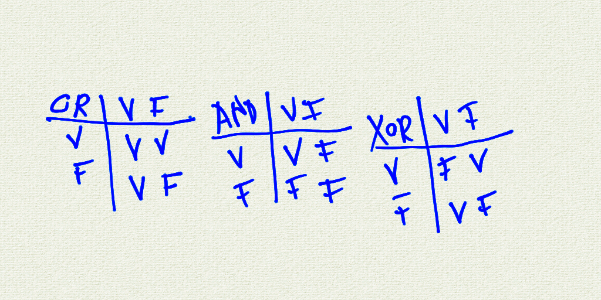

# Incontro del 27 marzo 2020 (effettuato in remoto)

## Argomenti

* Backtracking sulla sintassi `C` prima di re-analizzare il codice `osc` già prodotto:
  * puntatori:
    * esercizi su puntatori, *arrays* e stringhe

### Codice `C`

#### [Correzione dell'esercizio del 20 marzo - prima versione](./ptr1.c)

Versione con l'utilizzo dell'istruzione `break`

```C
/*I PUNTATORI*/
#include <stdio.h>
#include <string.h>
int main()
 {
   const int dim = 50 ;
   int i = 0;
   char nome[dim];
   /*definiamo un puntatore a char; il tipo del puntatore nell dichiarazione è il tipo scelto piu' la star (*)  */
   char *p;
   p = &nome[0];
   p = nome; /*il nome della variabile nome è in realtà l'indirizzo della prima locazione dell'array*/
   strcpy(nome , "trovi un gatto nero morto");
   for(i = 0; i < dim ; ++i)
   { /*%p è del puntatore*/
     printf("indirizzo: %p, contenuto: %1c\t%4d,  i: %2d\n", p , *p , *p, i);
     ++p;
     if (*p == '\0')
       break;
    }
 }
```

```sh
$ cc -o ptr1 ptr1.c
$ ./ptr1
indirizzo: 0x7ffd4860b1b0, contenuto: t	 116,  i:  0
indirizzo: 0x7ffd4860b1b1, contenuto: r	 114,  i:  1
indirizzo: 0x7ffd4860b1b2, contenuto: o	 111,  i:  2
indirizzo: 0x7ffd4860b1b3, contenuto: v	 118,  i:  3
indirizzo: 0x7ffd4860b1b4, contenuto: i	 105,  i:  4
indirizzo: 0x7ffd4860b1b5, contenuto:  	  32,  i:  5
indirizzo: 0x7ffd4860b1b6, contenuto: u	 117,  i:  6
indirizzo: 0x7ffd4860b1b7, contenuto: n	 110,  i:  7
indirizzo: 0x7ffd4860b1b8, contenuto:  	  32,  i:  8
indirizzo: 0x7ffd4860b1b9, contenuto: g	 103,  i:  9
indirizzo: 0x7ffd4860b1ba, contenuto: a	  97,  i: 10
indirizzo: 0x7ffd4860b1bb, contenuto: t	 116,  i: 11
indirizzo: 0x7ffd4860b1bc, contenuto: t	 116,  i: 12
indirizzo: 0x7ffd4860b1bd, contenuto: o	 111,  i: 13
indirizzo: 0x7ffd4860b1be, contenuto:  	  32,  i: 14
indirizzo: 0x7ffd4860b1bf, contenuto: n	 110,  i: 15
indirizzo: 0x7ffd4860b1c0, contenuto: e	 101,  i: 16
indirizzo: 0x7ffd4860b1c1, contenuto: r	 114,  i: 17
indirizzo: 0x7ffd4860b1c2, contenuto: o	 111,  i: 18
indirizzo: 0x7ffd4860b1c3, contenuto:  	  32,  i: 19
indirizzo: 0x7ffd4860b1c4, contenuto: m	 109,  i: 20
indirizzo: 0x7ffd4860b1c5, contenuto: o	 111,  i: 21
indirizzo: 0x7ffd4860b1c6, contenuto: r	 114,  i: 22
indirizzo: 0x7ffd4860b1c7, contenuto: t	 116,  i: 23
indirizzo: 0x7ffd4860b1c8, contenuto: o	 111,  i: 24
```

#### [Correzione dell'esercizio del 20 marzo - seconda versione](./ptr2.c)

Versione con l'utilizzo dell'istruzione `break` e *auto-incremento* e *dereferenziazione* `inline` del puntatore

```C
/*I PUNTATORI*/
#include <stdio.h>
#include <string.h>
int main()
 {
   const int dim = 50 ;
   int i = 0;
   char nome[dim];
   /*definiamo un puntatore a char; il tipo del puntatore nell dichiarazione è il tipo scelto piu' la star (*)  */
   char *p;
   p = &nome[0];
   p = nome; /*il nome della variabile nome è in realtà l'indirizzo della prima locazione dell'array*/
   strcpy(nome , "trovi un gatto nero morto");
   for(i = 0; i < dim ; ++i)
   { /*%p è del puntatore*/
     printf("indirizzo: %p, contenuto: %1c\t%4d,  i: %2d\n", p , *p , *p, i);
     if (*++p == '\0')
       break;
    }
 }
```

```sh
$ cc -o ptr2 ptr2.c
$ ./ptr2
indirizzo: 0x7fff994a7bf0, contenuto: t	 116,  i:  0
indirizzo: 0x7fff994a7bf1, contenuto: r	 114,  i:  1
indirizzo: 0x7fff994a7bf2, contenuto: o	 111,  i:  2
indirizzo: 0x7fff994a7bf3, contenuto: v	 118,  i:  3
indirizzo: 0x7fff994a7bf4, contenuto: i	 105,  i:  4
indirizzo: 0x7fff994a7bf5, contenuto:  	  32,  i:  5
indirizzo: 0x7fff994a7bf6, contenuto: u	 117,  i:  6
indirizzo: 0x7fff994a7bf7, contenuto: n	 110,  i:  7
indirizzo: 0x7fff994a7bf8, contenuto:  	  32,  i:  8
indirizzo: 0x7fff994a7bf9, contenuto: g	 103,  i:  9
indirizzo: 0x7fff994a7bfa, contenuto: a	  97,  i: 10
indirizzo: 0x7fff994a7bfb, contenuto: t	 116,  i: 11
indirizzo: 0x7fff994a7bfc, contenuto: t	 116,  i: 12
indirizzo: 0x7fff994a7bfd, contenuto: o	 111,  i: 13
indirizzo: 0x7fff994a7bfe, contenuto:  	  32,  i: 14
indirizzo: 0x7fff994a7bff, contenuto: n	 110,  i: 15
indirizzo: 0x7fff994a7c00, contenuto: e	 101,  i: 16
indirizzo: 0x7fff994a7c01, contenuto: r	 114,  i: 17
indirizzo: 0x7fff994a7c02, contenuto: o	 111,  i: 18
indirizzo: 0x7fff994a7c03, contenuto:  	  32,  i: 19
indirizzo: 0x7fff994a7c04, contenuto: m	 109,  i: 20
indirizzo: 0x7fff994a7c05, contenuto: o	 111,  i: 21
indirizzo: 0x7fff994a7c06, contenuto: r	 114,  i: 22
indirizzo: 0x7fff994a7c07, contenuto: t	 116,  i: 23
indirizzo: 0x7fff994a7c08, contenuto: o	 111,  i: 24
```

#### [Correzione dell'esercizio del 20 marzo - terza versione](./ptr3.c)

Versione con le condizioni di uscita in `AND` tra di loro.
A questo proposito viene effettuato un veloce ripasso delle tavole logiche di
verità:




```C
/*I PUNTATORI*/
#include <stdio.h>
#include <string.h>
int main()
 {
   const int dim = 50 ;
   int i = 0;
   char nome[dim];
   /*definiamo un puntatore a char; il tipo del puntatore nell dichiarazione è il tipo scelto piu' la star (*)  */
   char *p;
   p = &nome[0];
   p = nome; /*il nome della variabile nome è in realtà l'indirizzo della prima locazione dell'array*/
   strcpy(nome , "trovi un gatto nero morto");
   for(i = 0; *p != '\0' && i < dim ; ++i)
   { /*%p è del puntatore*/
     printf("indirizzo: %p, contenuto: %1c\t%4d,  i: %2d\n", p , *p , *p, i);
     ++p;
    }
 }
```

```sh
$ cc -o ptr3 ptr3.c
$ ./ptr3
indirizzo: 0x7ffefc777050, contenuto: t	 116,  i:  0
indirizzo: 0x7ffefc777051, contenuto: r	 114,  i:  1
indirizzo: 0x7ffefc777052, contenuto: o	 111,  i:  2
indirizzo: 0x7ffefc777053, contenuto: v	 118,  i:  3
indirizzo: 0x7ffefc777054, contenuto: i	 105,  i:  4
indirizzo: 0x7ffefc777055, contenuto:  	  32,  i:  5
indirizzo: 0x7ffefc777056, contenuto: u	 117,  i:  6
indirizzo: 0x7ffefc777057, contenuto: n	 110,  i:  7
indirizzo: 0x7ffefc777058, contenuto:  	  32,  i:  8
indirizzo: 0x7ffefc777059, contenuto: g	 103,  i:  9
indirizzo: 0x7ffefc77705a, contenuto: a	  97,  i: 10
indirizzo: 0x7ffefc77705b, contenuto: t	 116,  i: 11
indirizzo: 0x7ffefc77705c, contenuto: t	 116,  i: 12
indirizzo: 0x7ffefc77705d, contenuto: o	 111,  i: 13
indirizzo: 0x7ffefc77705e, contenuto:  	  32,  i: 14
indirizzo: 0x7ffefc77705f, contenuto: n	 110,  i: 15
indirizzo: 0x7ffefc777060, contenuto: e	 101,  i: 16
indirizzo: 0x7ffefc777061, contenuto: r	 114,  i: 17
indirizzo: 0x7ffefc777062, contenuto: o	 111,  i: 18
indirizzo: 0x7ffefc777063, contenuto:  	  32,  i: 19
indirizzo: 0x7ffefc777064, contenuto: m	 109,  i: 20
indirizzo: 0x7ffefc777065, contenuto: o	 111,  i: 21
indirizzo: 0x7ffefc777066, contenuto: r	 114,  i: 22
indirizzo: 0x7ffefc777067, contenuto: t	 116,  i: 23
indirizzo: 0x7ffefc777068, contenuto: o	 111,  i: 24
```

#### [Correzione dell'esercizio del 20 marzo - quarta versione](./ptr4.c)

Versione con l'utilizzo dell'istruzione `while`.

```C
/*I PUNTATORI*/
#include <stdio.h>
#include <string.h>
int main()
 {
   const int dim = 50 ;
   int i = 0;
   char nome[dim];
   /*definiamo un puntatore a char; il tipo del puntatore nell dichiarazione è il tipo scelto piu' la star (*)  */
   char *p;
   p = &nome[0];
   p = nome; /*il nome della variabile nome è in realtà l'indirizzo della prima locazione dell'array*/
   strncpy(nome , "tlovi un gatto nelo molto crocifisso sul mulo accanto a uno scendiletto postulale di un negozio di massaggi cinese", dim);
   nome[dim-1] = '\0';
   printf("%s\n", nome );
   while (*p != '\0' && i < dim)
     {
       printf("indirizzo: %p, contenuto: %1c\t%4d,  i: %2d\n", p , *p , *p, i);
       ++p;
       ++i;
     }

 }
```

```sh
$ cc -o ptr4 ptr4.c
$ ./ptr4
tlovi un gatto nelo molto crocifisso sul mulo acc
indirizzo: 0x7ffdab1c9e60, contenuto: t	 116,  i:  0
indirizzo: 0x7ffdab1c9e61, contenuto: l	 108,  i:  1
indirizzo: 0x7ffdab1c9e62, contenuto: o	 111,  i:  2
indirizzo: 0x7ffdab1c9e63, contenuto: v	 118,  i:  3
indirizzo: 0x7ffdab1c9e64, contenuto: i	 105,  i:  4
indirizzo: 0x7ffdab1c9e65, contenuto:  	  32,  i:  5
indirizzo: 0x7ffdab1c9e66, contenuto: u	 117,  i:  6
indirizzo: 0x7ffdab1c9e67, contenuto: n	 110,  i:  7
indirizzo: 0x7ffdab1c9e68, contenuto:  	  32,  i:  8
indirizzo: 0x7ffdab1c9e69, contenuto: g	 103,  i:  9
indirizzo: 0x7ffdab1c9e6a, contenuto: a	  97,  i: 10
indirizzo: 0x7ffdab1c9e6b, contenuto: t	 116,  i: 11
indirizzo: 0x7ffdab1c9e6c, contenuto: t	 116,  i: 12
indirizzo: 0x7ffdab1c9e6d, contenuto: o	 111,  i: 13
indirizzo: 0x7ffdab1c9e6e, contenuto:  	  32,  i: 14
indirizzo: 0x7ffdab1c9e6f, contenuto: n	 110,  i: 15
indirizzo: 0x7ffdab1c9e70, contenuto: e	 101,  i: 16
indirizzo: 0x7ffdab1c9e71, contenuto: l	 108,  i: 17
indirizzo: 0x7ffdab1c9e72, contenuto: o	 111,  i: 18
indirizzo: 0x7ffdab1c9e73, contenuto:  	  32,  i: 19
indirizzo: 0x7ffdab1c9e74, contenuto: m	 109,  i: 20
indirizzo: 0x7ffdab1c9e75, contenuto: o	 111,  i: 21
indirizzo: 0x7ffdab1c9e76, contenuto: l	 108,  i: 22
indirizzo: 0x7ffdab1c9e77, contenuto: t	 116,  i: 23
indirizzo: 0x7ffdab1c9e78, contenuto: o	 111,  i: 24
indirizzo: 0x7ffdab1c9e79, contenuto:  	  32,  i: 25
indirizzo: 0x7ffdab1c9e7a, contenuto: c	  99,  i: 26
indirizzo: 0x7ffdab1c9e7b, contenuto: r	 114,  i: 27
indirizzo: 0x7ffdab1c9e7c, contenuto: o	 111,  i: 28
indirizzo: 0x7ffdab1c9e7d, contenuto: c	  99,  i: 29
indirizzo: 0x7ffdab1c9e7e, contenuto: i	 105,  i: 30
indirizzo: 0x7ffdab1c9e7f, contenuto: f	 102,  i: 31
indirizzo: 0x7ffdab1c9e80, contenuto: i	 105,  i: 32
indirizzo: 0x7ffdab1c9e81, contenuto: s	 115,  i: 33
indirizzo: 0x7ffdab1c9e82, contenuto: s	 115,  i: 34
indirizzo: 0x7ffdab1c9e83, contenuto: o	 111,  i: 35
indirizzo: 0x7ffdab1c9e84, contenuto:  	  32,  i: 36
indirizzo: 0x7ffdab1c9e85, contenuto: s	 115,  i: 37
indirizzo: 0x7ffdab1c9e86, contenuto: u	 117,  i: 38
indirizzo: 0x7ffdab1c9e87, contenuto: l	 108,  i: 39
indirizzo: 0x7ffdab1c9e88, contenuto:  	  32,  i: 40
indirizzo: 0x7ffdab1c9e89, contenuto: m	 109,  i: 41
indirizzo: 0x7ffdab1c9e8a, contenuto: u	 117,  i: 42
indirizzo: 0x7ffdab1c9e8b, contenuto: l	 108,  i: 43
indirizzo: 0x7ffdab1c9e8c, contenuto: o	 111,  i: 44
indirizzo: 0x7ffdab1c9e8d, contenuto:  	  32,  i: 45
indirizzo: 0x7ffdab1c9e8e, contenuto: a	  97,  i: 46
indirizzo: 0x7ffdab1c9e8f, contenuto: c	  99,  i: 47
indirizzo: 0x7ffdab1c9e90, contenuto: c	  99,  i: 48
```

## Compiti per casa

* scrivere, compilare e far girare le seguenti funzioni:
  * `mystrlen` (da [`strlen`](https://en.cppreference.com/w/c/string/byte/strlen)
  * `mystrnlen` (da [`strnlen`](https://en.cppreference.com/w/c/string/byte/strlen)
  * `mystrcpy` (da [`strcpy`](https://en.cppreference.com/w/c/string/byte/strcpy)
  * `mystrncpy` (da [`strncpy`](https://en.cppreference.com/w/c/string/byte/strncpy)
  * `conta_vocali` (una funzione che conti le vocali di una stringa passata in argomento)
