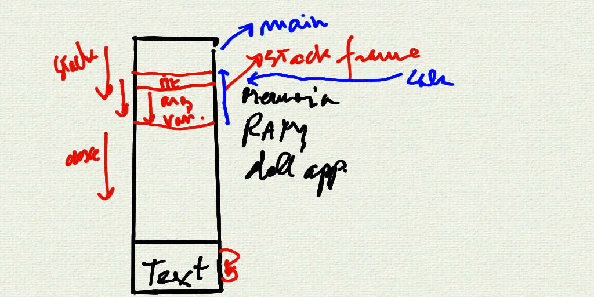

# Incontro del 3 aprile 2020 (effettuato in remoto)

## Argomenti

* Backtracking sulla sintassi `C` prima di re-analizzare il codice `osc` già prodotto:
  * puntatori:
    * correzione degli esercizi dati per casa
    * l'utilizzo di `const` nei puntatori
    * equivalenza *arrays*/puntatori (similitudini e differenze)

## Compiti svolti

### [`mystrlen`](./mystrlen.c)

```C
#include <stdio.h>
#include <string.h>

int mystrlen( char string[]);

int main ()
{
  char string[]= "you did man ";
  int realsize = 0;

  printf("%s\n", string);

  realsize = mystrlen(string);
  printf("%d\n", realsize);
}


int mystrlen(char string[])
{

  int n = 0;
  while ( string[++n] != '\0');
  return n;
}
```

```sh
$ cc -o mystrlen mystrlen.c
$ ./mystrlen
you did man
12
```

### [`mystrcpy` (realizzato con gli indici)](./mystrcpy.c)

```C
#include <stdio.h>
#include <string.h>

void mystrcpy(char dest[] , char src[]);

int main()
{
  int size2 = 4096;
  char string1[] = {"ma vedi mpo'"};
  char string2[];

  mystrcpy(string2 , string1);
  printf("str 2 is %s\n", string2);
}

void mystrcpy(char dest[] , char src[])
{

  size_t i =0;
  while ((dest[i] = src[i]) != '\0')
    ++i;
}
```

```sh
$ cc -o mystrcpy mystrcpy.c
$ ./mystrcpy
str 2 is ma vedi mpo'
```

### [`mystrcpy` (realizzato con i puntatori)](./mystrcpy_p.c)

```C
#include <stdio.h>

char *mystrcpy(char *dest , const char *S );

int main()
{
  int size2 = 4096;
  char string1[] = {"ma vedi mpo'"};
  char string2[size2];
  char *o = mystrcpy(string2 , string1);
  puts(o);
  mystrcpy(string2 , string1);
  printf("str 2 is %s\n", string2);
}

char *mystrcpy(char *dest , const char *S) /* il valore di ritrono è char * cioè un puntatore a un carattere*/
{
  char *r = dest;
  while ((*dest++ = *S++) != '\0'); /*prendo il contenuto di s e lo metto in dest , poi incremento entrambi*/
  return r;
}
```

```sh
$ cc -o mystrcpy_p mystrcpy_p.c
$ ./mystrcpy_p
ma vedi mpo'
str 2 is ma vedi mpo'
```

### [descrittore di stringhe](./cap.c)

```C
#include <stdio.h>

int main()
{
  char string[] = "bella flate'";
  char *p = string;
  char s;
  while((s = *p++) != '\0')
    printf("indirizzo: %p , carattere %c , stringa : %s\n", p-1 , s, string);
}
```

```sh
$ cc -o cap cap.c
$ ./cap
indirizzo: 0x7ffef77ca93a , carattere b , stringa : bella flate'
indirizzo: 0x7ffef77ca93b , carattere e , stringa : bella flate'
indirizzo: 0x7ffef77ca93c , carattere l , stringa : bella flate'
indirizzo: 0x7ffef77ca93d , carattere l , stringa : bella flate'
indirizzo: 0x7ffef77ca93e , carattere a , stringa : bella flate'
indirizzo: 0x7ffef77ca93f , carattere   , stringa : bella flate'
indirizzo: 0x7ffef77ca940 , carattere f , stringa : bella flate'
indirizzo: 0x7ffef77ca941 , carattere l , stringa : bella flate'
indirizzo: 0x7ffef77ca942 , carattere a , stringa : bella flate'
indirizzo: 0x7ffef77ca943 , carattere t , stringa : bella flate'
indirizzo: 0x7ffef77ca944 , carattere e , stringa : bella flate'
indirizzo: 0x7ffef77ca945 , carattere ' , stringa : bella flate'
```

## Lavagne (allocazione della memoria per gli argomenti e le variabili volatili)



## Compiti per casa

* scrivere, compilare e far girare piccoli programmi per verificare l'effettiva consistenza
  degli argomenti visti in classe:
  * `my_strcat` (rif: http://www.fortran-2000.com/ArnaudRecipes/Cstd/2.14.html#strcat)
  * `my_strncat` (rif: http://www.fortran-2000.com/ArnaudRecipes/Cstd/2.14.html#strncat)
  * `my_strcmp` (rif: http://www.fortran-2000.com/ArnaudRecipes/Cstd/2.14.html#strcmp)
  * `my_strncmp` (rif: http://www.fortran-2000.com/ArnaudRecipes/Cstd/2.14.html#strncmp)
  * `my_strchar` (rif: http://www.fortran-2000.com/ArnaudRecipes/Cstd/2.14.html#strchar)
  * `my_strrchar` (rif: http://www.fortran-2000.com/ArnaudRecipes/Cstd/2.14.html#strrchar)
