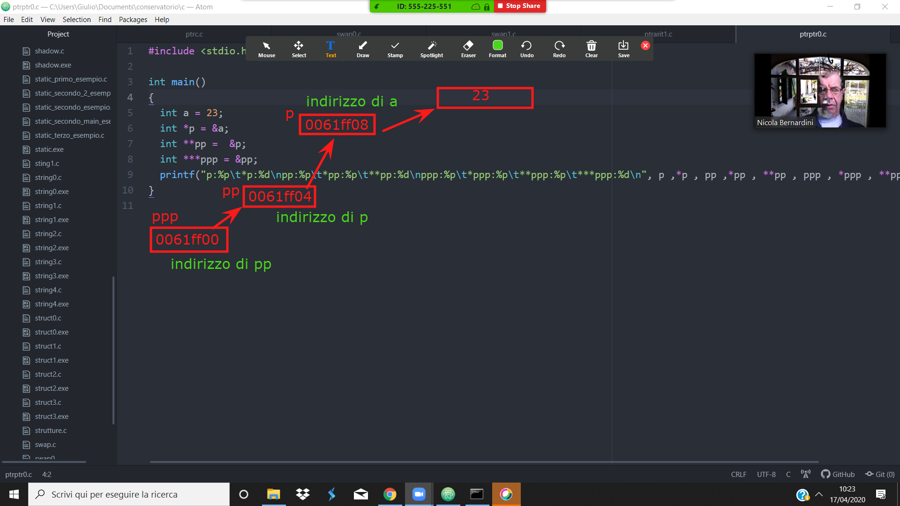

# Incontro del 17 aprile 2020 (effettuato in remoto)

## Argomenti

* Backtracking sulla sintassi `C` prima di re-analizzare il codice `osc` già prodotto:
  * puntatori:
    * l'utilizzo di `const` nei puntatori
    * passaggio di argomenti per *valore* e passaggio per *referenza*
    * *handles*, puntatori multipli ecc.

## Codice `C` scritto in classe:

### [`const <type> *` vs. `<type> *const`](./ptrc.c)

Quest esempio delinea i due tipi di attributo `const` che possono essere
definiti per i puntatori:

1. `const <type> *`: il *contenuto* è costante e non può essere modificato
1. `<type> *const`: il *puntatore* è costante e non può essere spostato

```C
#include <stdio.h>              /* PUNTATORI COSTANTI */
int main()
{
  int a = 23;
  const int *pc = &a ;          /*ptr a contenuto const che punta verso a*/

  int *const cp = &a ;          /*ptr a indirizzo costante, non a contenuto*/

  /*   *pc = 24 ;  */           /*NON PERMESSO,proviamo a cambiare il contenuto*/
  /*   ++cp;      */            /*NON PERMESSO, cambio l'indirizzo*/
  ++pc;                         /*PERMESSO poiche' l'indirizzo non e' costante*/
  *cp = 24;                     /*PERMESSO poiche' il contenuto non e' costante*/

}
```

### [implementazione *ERRATA* della funzione `swap`](./swap0.c)

```C
#include <stdio.h>   /*ARGOMENTI PASSATI PER VALORE E NON PER RIFERIMENTO*/

void swap(int a, int b)
{
  int tmp = b;
  b = a;
  a = tmp;
}


int main()
{
  int a = 23 , b = 16;
  swap(a,b);
  printf("a: %d, b: %d\n", a, b);
}
```

```sh
$ cc -o swap0 swap0.c
$ ./swap0
a: 23, b: 16
```

Questa implementazione è errata perché non tiene conto del fatto che gli
argomenti sono passati alle funzioni per *valore*, ossia viene copiato il valore
delle variabili nello *stack* e sono questi *valori* che vengono scambiati,
non i valori presenti all'esterno della funzione. E quindi il programma, alla
fine, non effettua lo scambio voluto.

### [implementazione *CORRETTA* della funzione `swap`](./swap1.c)

```C
#include <stdio.h>   /*DIMOSTRAZIONE COME PASSARE PTR A FUNZIONI*/

void swap(int *a, int *b)
{
  int tmp = *b;
  *b = *a;
  *a = tmp;
}

int main()
{
  int a = 23, b= 16;
  swap(&a, &b);
  printf("a: %d, b: %d\n", a, b);
}
```

```sh
$ cc -o swap1 swap1.c
$ ./swap1
a: 16, b: 23
```

L'implementazione *corretta* della funzione di swap prevede il passaggio *per
referenza*, che in `C` si realizza passando *gli indirizzi* delle variabili e
non i valori contenuti.

### [l'aritmetica dei puntatori - 1](./ptrarit0.c)

```C
#include <stdio.h> /*ARITMETICA DEI PUNTATORI*/

struct big
{
  double superbig[1000];
  long megabig[1001];
};

int main()
{
  char small;
  int medium;
  double large;
  struct big huge;
  char *smallp = &small;
  int *mediump = &medium;
  double *largep = &large;
  struct big *hugep = &huge;
  printf("char: %p\tincrement: %p, difference:%d\n",smallp , smallp+1, (smallp+1)-smallp);
  printf("int: %p\tincrement: %p, difference:%d\n",mediump , mediump+1, (mediump+1)-mediump);
  printf("double: %p\tincrement: %p, difference:%d\n",largep , largep+1, (largep+1)-largep);
  printf("huge: %p\tincrement: %p, difference:%d\n",hugep , hugep+1, (hugep+1)-hugep);
}
```

```sh
$ cc -o ptrarit0 ptrarit0.c 
$ ./ptrarit0
char: 0x7ffe18f1733f	increment: 0x7ffe18f17340, difference:1
int: 0x7ffe18f17338	increment: 0x7ffe18f1733c, difference:1
double: 0x7ffe18f17330	increment: 0x7ffe18f17338, difference:1
huge: 0x7ffe18f134a0	increment: 0x7ffe18f17328, difference:1
```

Come si può notare, i puntatori seguono la dimensione dei tipi (sia naturali
che artificiali). In linea generale, l'incremento di un puntatore segue la
dimensione del tipo al quale si riferisce (in questo caso e su *questa*
macchina a 64-bit: 1 byte per i `char`, 4 byte per un `int`, 8 byte per un
`double`, e 12008 byte per la struttura definita `struct big`.

### [l'aritmetica dei puntatori - 2 - introduzione ai `cast` e ai `void *`](./ptrarit1.c)

```C
#include <stdio.h> /*ARITMETICA DEI PUNTATORI*/

struct big
{
  double superbig[1000];
  long megabig[1001];
  char poco[13];
};
                      /*void ptr è un puntatore senza grandezza dichiarata*/
int main()
{
  char small;
  int medium;
  double large;
  struct big huge;
  char *smallp = &small;
  int *mediump = &medium;
  double *largep = &large;
  struct big *hugep = &huge;
  void *smallvp = smallp, *mediumvp = mediump, *largevp = largep, *hugevp = hugep;
  /*CAST = conversione del tipo di puntatore, si moltiplica puntatore per void*   */

  printf("char: %p\tincrement: %p, difference:%d\n",smallp , smallp+1, ((void*)(smallp+1))-smallvp);
  printf("int: %p\tincrement: %p, difference:%d\n",mediump , mediump+1, ((void*)(mediump+1))-mediumvp);
  printf("double: %p\tincrement: %p, difference:%d\n",largep , largep+1, ((void*)(largep+1))-largevp);
  printf("huge: %p\tincrement: %p, difference:%d\n",hugep , hugep+1, ((void*)(hugep+1))-hugevp);

}
```

```sh
nicb-p302u:.../20200417$ cc -o ptrarit1 ptrarit1.c 
nicb-p302u:.../20200417$ ./ptrarit1
char: 0x7ffd9844400f	increment: 0x7ffd98444010, difference:1
int: 0x7ffd98444008	increment: 0x7ffd9844400c, difference:4
double: 0x7ffd98444000	increment: 0x7ffd98444008, difference:8
huge: 0x7ffd98440160	increment: 0x7ffd98443ff8, difference:16024
```

Per poter calcolare la differenza di incremento in byte è necessario ricorrere
ai puntatori generici `void *` che non hanno indicazione tipologica e quindi
servono a rappresentare il concetto di *puntatore puro*. Un `void *` può
quindi puntare a qualsiasi tipo di puntatore, ma il contrario non è ugualmente
vero.

### [puntatori di puntatori](./ptrptr0.c)

```C
#include <stdio.h>    /* PUNTATORI DI PUNTATORI */

int main()
{
  int a = 23;
  int *p = &a;
  int **pp =  &p;
  int ***ppp = &pp;
  printf("p:%p\t*p:%d\npp:%p\t*pp:%p\t**pp:%d\nppp:%p\t*ppp:%p\t**ppp:%p\t***ppp:%d\n", p ,*p , pp ,*pp , **pp , ppp , *ppp , **ppp , ***ppp);
}
```

```sh
nicb-p302u:.../20200417$ cc -o ptrptr0 ptrptr0.c
nicb-p302u:.../20200417$ ./ptrptr0
p:0x7ffc83d9b594	*p:23
pp:0x7ffc83d9b588	*pp:0x7ffc83d9b594	**pp:23
ppp:0x7ffc83d9b580	*ppp:0x7ffc83d9b588	**ppp:0x7ffc83d9b594	***ppp:23
```

La spiegazione del funzionamento è riportato in queste annotazioni sullo
schermo:



### [array di puntatori e puntatori di puntatori](./ptrptr1.c)

```C
#include <stdio.h>    /* PUNTATORI DI PUNTATORI DI ARRAY */

int main()
{
  int a[] = {0 , 1 , 2 , 3 , 4};
  int *p[] = {a , &a[1] , &a[2] , &a[3] , &a[4]}; /*array di puntatori*/
  int **pp =  p;

  /*ESERCIZIO: provare a incrementare e decrementare a e dare una spiegzione*/
}
```

## Compiti per casa

* scrivere i seguenti programmi:
  * `my_strcmp` (rif: http://www.fortran-2000.com/ArnaudRecipes/Cstd/2.14.html#strcmp)
  * `my_strncmp` (rif: http://www.fortran-2000.com/ArnaudRecipes/Cstd/2.14.html#strncmp)
  * `my_strchar` (rif: http://www.fortran-2000.com/ArnaudRecipes/Cstd/2.14.html#strchar)
  * `my_strrchar` (rif: http://www.fortran-2000.com/ArnaudRecipes/Cstd/2.14.html#strrchar)
* provare a incrementare e decrementare i puntatori di puntatori in [`ptrptr1.c`](./ptrptr1.c) a e dare una spiegzione
