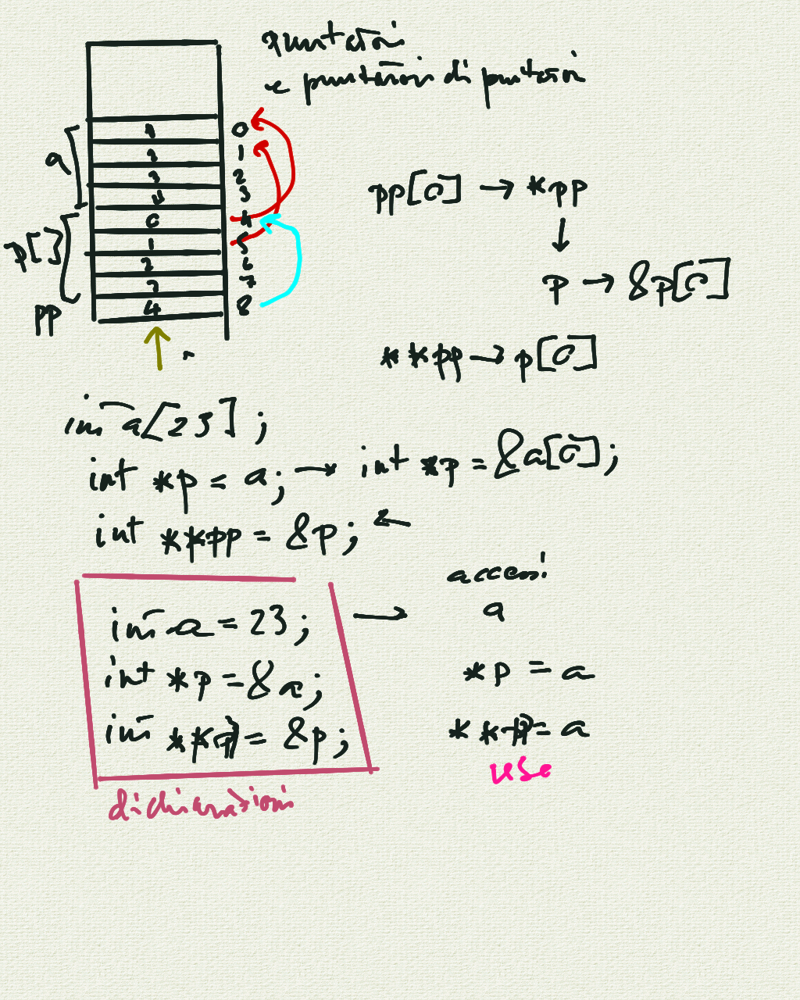
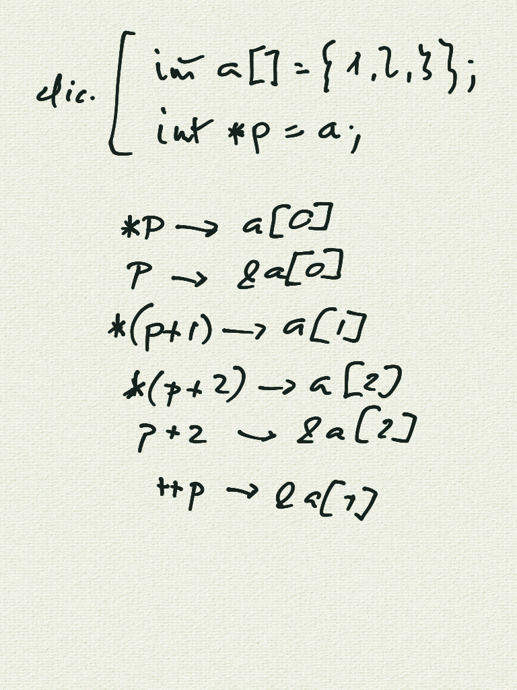

# Incontro del 24 aprile 2020 (effettuato in remoto)

## Argomenti

* Backtracking sulla sintassi `C` prima di re-analizzare il codice `osc` già prodotto:
  * puntatori, e puntatori di puntatori

## Lavagne





### Codice `C`

#### [Creazione di una *segmentation violation* (accesso errato alla memoria)](./expp.c)

```C
#include <stdio.h>

int main()
{
        /* dichiarazione */
        int a = 23;      /* variabile */
        int *p = &a;     /* puntatore a una variabile */
        int **pp = &p;   /* puntatore a un puntatore a una variabile */

        /* uso */
        printf("a: %d\n", a);
        printf("p: %p, *p: %d\n", p, *p);
        printf("pp: %p, *pp: %p, **pp: %d\n", pp, *pp, **pp);

        /* KA-BOOM */
        pp-=1000;
        printf("pp: %p, *pp: %p, **pp: %d\n", pp, *pp, **pp);
}
```

Questo codice è scritto appositamente male per generare una `segmentation
violation`, ossia un errore di accesso alla memoria. In effetti, compilando ed
eseguendo:

```sh
$ cc -o expp expp.c
$ ./expp
a: 23
p: 0x7ffd089c4564, *p: 23
pp: 0x7ffd089c4558, *pp: 0x7ffd089c4564, **pp: 23
Segmentation fault # QUI IL PROGRAMMA SI CONCLUDE MALAMENTE
```

#### [Accesso ai membri di una struttura attraverso dei puntatori](./strptr.c)

```C
#include <stdio.h>

struct A
{
        int i;
        double d;
        char c;
};

int main()
{
        struct A s = { 23, 23e23, 'a' };
        struct A *pA = &s;
        int *pint = &s.i;
        char *pchar = &s.c;
        double *pdouble = &s.d;

        printf("sizeof di A: %d\n", sizeof(s));
        printf("pA: %p\n", pA);
        printf("pint: %p\n", pint);
        printf("pchar: %p\n", pchar);
        printf("pdouble: %p\n", pdouble);
}
```

```sh
$ cc -o strptr strptr.c
$ ./strptr
sizeof di A: 24
pA: 0x7fff16bcd450
pint: 0x7fff16bcd450
pchar: 0x7fff16bcd460
pdouble: 0x7fff16bcd458
```

## Compiti per casa

* scrivere, compilare e far girare piccoli programmi per verificare l'effettiva consistenza
  degli argomenti visti in classe:
  * puntatori:
    * dichiarazione, utilizzo, de-referenziazione
    * puntatori multipli
