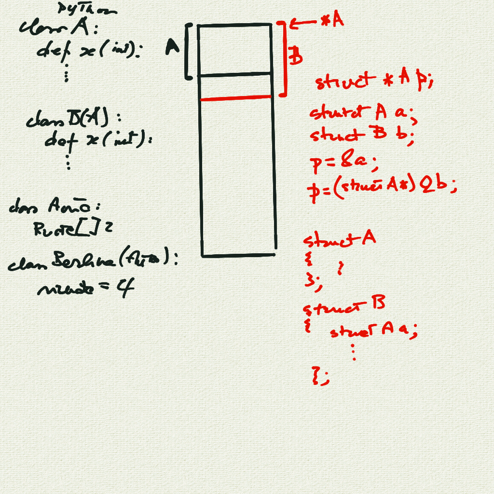

# Incontro del 8 maggio 2020 (effettuato in remoto)

## Argomenti

* Backtracking sulla sintassi `C` prima di re-analizzare il codice `osc` già prodotto:
  * puntatori a funzioni

### Codice `C` creato in classe

#### [I puntatori a funzioni](./puntatori_a_funzioni.c)

```C
#include <stdio.h>

int funzione_a(const int a)
{
	int (*p)(const int) = funzione_a ;
	printf("sono la funzione a e il mio valore e %p\n",p);
	return a;
}

int funzione_b(const int a)
{
	printf("sono la funzione b e il mio valore e %d\n",a);
	return a;
}

int main ()
{
	int (*p)(const int);
	p=funzione_a;
	(*p)(42);
	p=funzione_b;
	(*p)(23);
	
}
```

```sh
$ cc -o puntatori_a_funzioni puntatori_a_funzioni.c
$ ./puntatori_a_funzioni
sono la funzione a e il mio valore e 0x55abb0809135
sono la funzione b e il mio valore e 23
```

#### [Puntatori a funzione e OOP - un esempio pratico](./forma.c)



```C
#include <stdio.h>

struct FormaGeometrica
{
	void(*disegnati)(const struct FormaGeometrica*);
};

struct Quadrato
{
	struct FormaGeometrica fg;     /*istanza Forma Geometrica*/
};

struct Triangolo 
{
	struct FormaGeometrica fg;
};

void disegnati_fg(const struct FormaGeometrica *buttalo)
{
	printf("non disegno nulla\n");
}

void disegnati_Quadrato(const struct FormaGeometrica *buttalo)
{
	printf("disegno un quadrato\n");
}

void disegnati_Triangolo(const struct FormaGeometrica *buttalo)
{
	printf("disegno un triangolo\n");
}

int main ()
{
	struct FormaGeometrica Giulio = {disegnati_fg};
	struct Quadrato  Gabriele     = {{disegnati_Quadrato}};
	struct Triangolo Francesco    = {{disegnati_Triangolo}};
	struct FormaGeometrica*p ;
	
	p= &Giulio;
	(*(p->disegnati))(p);
	p= (struct FormaGeometrica*)&Gabriele;
	(*(p->disegnati))(p);
	p= (struct FormaGeometrica*)&Francesco;
	(*(p->disegnati))(p);
	
}

```

```sh
$ cc -o forma forma.c
$ ./forma
non disegno nulla
disegno un quadrato
disegno un triangolo
```

## Compiti per casa

* scrivere, compilare e far girare piccoli programmi per verificare l'effettiva consistenza
  degli argomenti visti in classe:
  * realizzare il disegno grafico in ASCII delle forme prese in considerazione
