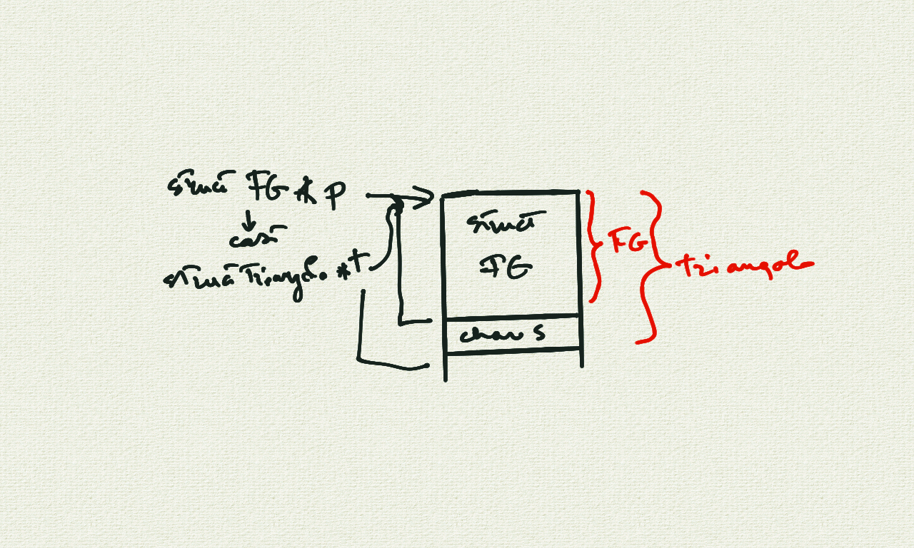
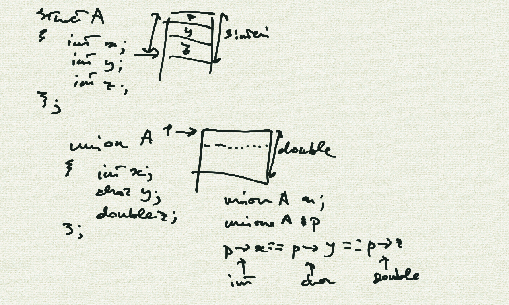

# Incontro del 15 maggio 2020 (effettuato in remoto)

## Argomenti

* Backtracking sulla sintassi `C` prima di re-analizzare il codice `osc` già prodotto:
  * l'uso dei puntatori a funzione in *object-oriented programming*
  * la stenografia `->`
  * unioni
  * argomenti alla funzione `main`: argomenti della linea di comando

## l'uso dei puntatori a funzione in *object-oriented programming*



## la stenografia `->`


## Unioni



### [unione.c](./unione.c)

```C
#include <stdio.h>
#include <math.h>
union A
{
  int x;
  char y;
  double z;
};

int main()
{
  union A a;
  union A *p=&a;
  a.z=M_E;
  printf("%p visto come double: %20.18f\n",p,p->z);
  printf("%p visto come char: '%c' (%d)\n",p,p->y,p->y);
  printf("%p visto come int: %d\n",p,p->x);
}
```

```sh
$ cc -o unione unione.c
$ ./unione
0x7fffd723f5e0 visto come double: 2.718281828459045091
0x7fffd723f5e0 visto come char: 'i' (105)
0x7fffd723f5e0 visto come int: -1961601175
```

## Argomenti sulla linea di comando

### [ciao0.c](./ciao0.c)

```C
#include <stdio.h>

int main(int argc,const char *argv[])
{
  printf("ciao %s!\n", argv[1]);
}
```

```sh
$ cc -o ciao0 ciao0.c
$ ./ciao0 corso
ciao corso!
```

### [ciao1.c](./ciao1.c)

```C
#include <stdio.h>

int main(int argc,const char *argv[])
{
  if (argc <2)
  {
    printf("%s: utilizzo\n%s nome...\n",argv[0],argv[0]);
    return -1;
  }
  printf("ciao %s!\n", argv[1]);
  return 0;
}
```

```sh
$ cc -o ciao1 ciao1.c
$ ./ciao1
./ciao1: utilizzo
./ciao1 nome...
$ ./ciao1 corso
ciao corso!
```

### [ciao2.c](./ciao2.c)

```C
#include <stdio.h>

int main(int argc,const char *argv[])
{
  int c=1;
  if (argc <2)
  {
    printf("%s: utilizzo\n%s nome...\n",argv[0],argv[0]);
    return -1;
  }
  printf("ciao");
  while(c<argc)
  {
    printf(" %s", argv[c]);
    ++c;
  }
  printf("!\n");
  return 0;
}
```

```sh
$ ./ciao2
./ciao2: utilizzo
./ciao2 nome...
$ ./ciao2 Francesco Giulio Gabriele Filippo Milo
ciao Francesco Giulio Gabriele Filippo Milo!
```

## Compiti per casa

* scrivere, compilare e far girare piccoli programmi per verificare l'effettiva consistenza
  degli argomenti visti in classe:
  * unioni
  * argomenti sulla linea di comando
